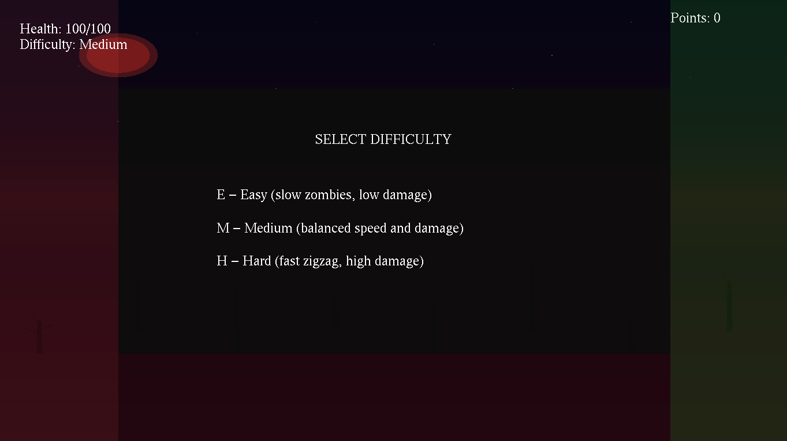
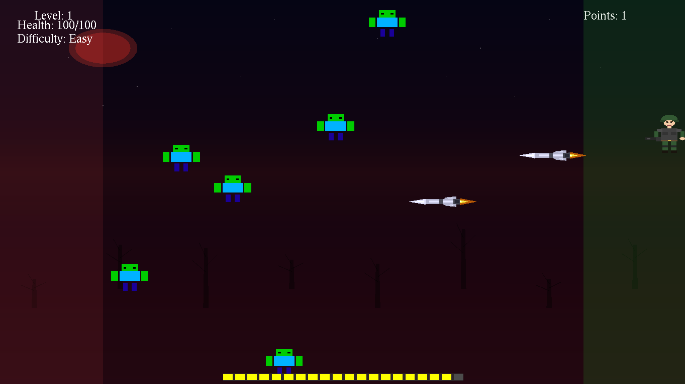
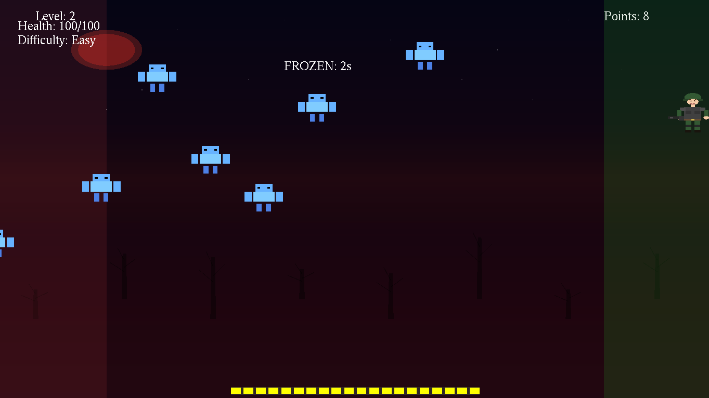

# OpenGL Game Collection

A collection of OpenGL-based games and graphical demos built with C++ using GLUT (OpenGL Utility Toolkit). The main feature is a **Zombie Shooter** tower defense game, along with character animation demonstrations.

## 🎮 Games & Demos

### 1. Zombie Shooter (FinalProject)
A fast-paced tower defense game where you protect your server from incoming zombie hackers!

**Gameplay:**
- Control a stickman character to defend against waves of zombies
- Shoot bullets to eliminate zombies before they breach your server
- Earn points by killing zombies and use them to purchase upgrades
- Progress through 20 increasingly difficult levels

**Features:**
- 🔫 Multiple bullet types (Normal, Orange, Red) with different damage levels
- 🛡️ Server shield upgrades for temporary protection
- 📊 Ammunition system with auto-reload
- 🧟 Zigzag movement patterns for zombies at higher levels
- 🏪 In-game shop for purchasing upgrades
- 📈 Progressive difficulty with faster and tougher zombies

### 2. Soldier Man Animation (Root)
A simple animation demo featuring a Soldier character that moves around the screen in a defined pattern.







### 3. Eve Character Transformations (transformation/)
An interactive demo showcasing geometric transformations (rotation, scaling, translation) applied to a character drawn using geometric primitives.

## 📋 Prerequisites

Before building, ensure you have the following installed:

- **C++ Compiler** (g++ or clang++)
- **OpenGL** - Graphics library
- **GLUT/FreeGLUT** - OpenGL Utility Toolkit
- **GLU** - OpenGL Utility Library

### Installing Dependencies

**Ubuntu/Debian:**
```bash
sudo apt-get update
sudo apt-get install build-essential freeglut3-dev libgl1-mesa-dev libglu1-mesa-dev
```

**Fedora:**
```bash
sudo dnf install gcc-c++ freeglut-devel mesa-libGL-devel mesa-libGLU-devel
```

**macOS (using Homebrew):**
```bash
brew install freeglut
```

**Windows:**
- Install [MSYS2](https://www.msys2.org/) or [MinGW](https://www.mingw-w64.org/)
- Install FreeGLUT package for your environment

## 🔧 Building the Project

### Zombie Shooter (Main Game)
```bash
cd FinalProject
g++ -o zombie_shooter main.cpp -lGL -lGLU -lglut -lm
```

### Stick Man Animation
```bash
g++ -o stickman stick_man.cpp -lGL -lGLU -lglut -lm
```

### Transformation Demo
```bash
cd transformation
g++ -o transformation main.cpp -lGL -lGLU -lglut -lm
```

## 🚀 Running the Games

### Zombie Shooter
```bash
cd FinalProject
./zombie_shooter
# or
./main
```

### Stick Man Animation
```bash
./stickman
# or
./main
```

### Transformation Demo
```bash
cd transformation
./transformation
# or
./main
```

## 🎮 Game Controls

### Zombie Shooter

| Key | Action |
|-----|--------|
| `↑` (Up Arrow) | Move player up |
| `↓` (Down Arrow) | Move player down |
| `Space` | Shoot bullet |
| `S` | Open/Close shop |
| `B` | Purchase bullet upgrade |
| `U` | Purchase server shield upgrade |
| `ESC` | Exit game / Restart after game over |

### Transformation Demo

| Input | Action |
|-------|--------|
| Click "Rotation" button | Start rotation animation |
| Click "Scaling" button | Start scaling animation |
| Click "Translation" button | Start translation animation |

## 📁 Project Structure

```
openGL_Game/
├── FinalProject/           # Main Zombie Shooter game
│   ├── main.cpp           # Game source code
│   ├── danila_CHAR.cpp    # Character definitions
│   └── main               # Compiled executable
├── transformation/         # Transformation demo
│   ├── main.cpp           # Demo source code
│   └── main               # Compiled executable
├── stick_man.cpp          # Stickman animation source
├── main.cpp               # Entry point for stickman
├── main                   # Compiled stickman executable
└── README.md              # This file
```

## 🎯 Game Mechanics (Zombie Shooter)

### Zones
- **Server Zone** (Right, Green): Your base to protect
- **Hacker Zone** (Left, Red): Zombie spawn area with speed boost

### Upgrades

| Upgrade | Cost | Effect |
|---------|------|--------|
| Orange Bullets | 10 coins | 2x damage |
| Red Bullets | 30 coins | 3x damage |
| Server Shield | 20 coins | 30 seconds of protection |

### Levels
- Start with Level 1 and progress up to Level 20
- Each level spawns more zombies (6 + level number)
- Zombies get faster and tougher at higher levels
- Zigzag movement pattern unlocks at Level 4
- Zombie health increases at Levels 2, 3, 4, and 10

## 🛠️ Technical Details

- **Graphics API:** OpenGL with GLUT
- **Display Mode:** Double buffering with RGB color
- **Window Size:** 1200x900 (Zombie Shooter), 500x500 (Stick Man), 800x600 (Transformation)
- **Frame Rate:** ~40 FPS (25ms timer for Zombie Shooter), ~60 FPS (16ms timer for others)
- **Coordinate System:** 2D orthographic projection (-1.0 to 1.0)

## 👥 Authors

- **Girgis Emad** - Stick Man character and animations
- Contributors - Zombie Shooter game development

## 📄 License

This project is created for educational purposes. Feel free to use, modify, and distribute.

---

*Built with ❤️ using OpenGL*
